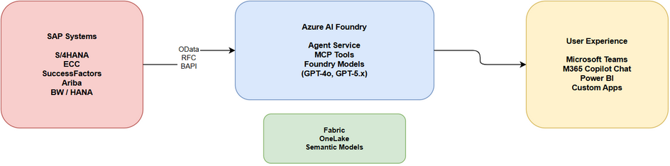

# Foundry AI and SAP Overview

> [!Important]
> When consuming SAP APIs and interfaces, always ensure your usage complies with [SAP's API Policy](https://help.sap.com/doc/sap-api-policy/latest/en-US/API_Policy_latest.pdf). Please check with your SAP contact or account team if you have questions about permitted API usage in your specific scenario.

SAP systems are the operational backbone of many enterprises— managing financials, supply chain, procurement, HR, and more. With **Azure AI Foundry**, organizations can transform these systems of record into AI-powered systems of intelligence by building enterprise-grade agents that reason over SAP data and take action across business processes.

This page covers how Azure AI Foundry and the broader Microsoft AI stack integrate with SAP to enable agentic AI scenarios.

> [!Important]
> Prior to implementing an SAP AI scenario review the SAP API Policy for usage guidelines and restrictions [SAP API Policy](https://help.sap.com/doc/sap-api-policy/latest/en-US/API_Policy_latest.pdf) documentation.

## The AI Innovation Layers for SAP

Microsoft offers three complementary layers for bringing AI to SAP environments:

| Layer | What it does | Tools |
| --- | --- | --- |
| **Use out-of-the-box** | Prebuilt AI experiences across SAP and Microsoft apps | Joule (SAP), Microsoft 365 Copilot |
| **Extend with custom agents** | Build company-specific agents with low-code/pro-code | Copilot Studio, Microsoft 365 Agents SDK |
| **Build enterprise AI solutions** | Full AI platform for advanced agents, custom models, and orchestration | Azure AI Foundry, Copilot Studio |

These layers aren't mutually exclusive — most organizations use a combination depending on the business process and complexity involved.

## Integration Patterns

There are three primary patterns for connecting AI agents to SAP data:

### Pattern 1: Direct API Consumption

The agent calls SAP OData or REST APIs in real-time via HTTP connectors or plugins.

- **Best for:** Simple lookups, transactional queries, real-time status checks
- **How it works:** Copilot Studio or Foundry agent → HTTP action → SAP OData/REST API → response displayed in Teams or Copilot
- **Pros:** Real-time data, simple setup, no data pipeline needed
- **Cons:** Limited to what the API exposes; not ideal for complex analytics or historical comparisons

### Pattern 2: Data Lake + Semantic Model

SAP data is extracted into Microsoft Fabric, modeled as a semantic model, and consumed by agents via Fabric Data Agents.

- **Best for:** Complex analytics, historical trends, cross-source reporting, dashboards
- **How it works:** SAP → Fabric Pipeline / Dataflow Gen2 → Lakehouse → Semantic Model → Copilot agent (via Fabric Data Agent)
- **Pros:** Rich analytics, governed data, combines SAP with non-SAP sources, supports Power BI dashboards
- **Cons:** Not real-time (batch/scheduled), requires Fabric setup

### Pattern 3: MCP Tools (Model Context Protocol)

Agents connect to SAP backends via MCP servers — lightweight tool endpoints that expose SAP functions as callable tools for AI agents.

- **Best for:** Multi-step workflows, combining multiple SAP operations in one agent, agentic scenarios
- **How it works:** Agent → MCP protocol (JSON-RPC 2.0) → MCP server (for example, FastAPI backend) → SAP APIs (OData, RFC, BAPI)
- **Pros:** Flexible, supports complex orchestration, natural language interaction with SAP
- **Cons:** Requires building and hosting MCP server endpoints

> [!Tip]
> These patterns can be combined. For example, an agent might use **direct API calls** for real-time PO status checks, a **Fabric Data Agent** for spend analysis dashboards, and **MCP tools** for multi-step approval workflows — all within the same Copilot experience.

## Agent Scenarios for SAP

### Finance — Record to Report

A CFO Financial Assistant that queries SAP financial data and triggers actions:

- Query GL accounts, cost centers, and profit centers using natural language
- Detect duplicate transactions across fiscal periods
- Analyze variance reports and profitability
- Trigger approval workflows and notify finance teams via Teams
- Post accounting documents via BAPIs (BAPI_ACC_DOCUMENT_POST, BAPI_ACC_DOCUMENT_CHECK)

### Procurement — Procure to Pay

Agents that provide procurement insights and streamline purchasing workflows:

- Query SAP Ariba operational reporting APIs for purchase requisitions
- Analyze spend by supplier, category, and region
- Monitor PO status, pending approvals, and supplier payments
- Combine Ariba data with S/4HANA procurement data in Fabric for unified spend analysis

### HR — Hire to Retire

SuccessFactors integration for employee self-service and HR operations:

- Query Employee Central data (background, work history, team info)
- Create and manage FMLA (Family and Medical Leave) requests
- Surface leaves summaries and balances in natural language
- Integrate with Microsoft 365 Copilot Employee Self-Service agent

### SAP CoE Assistant

A multi-function agent for SAP operations and development teams:

- Explain ABAP code snippets
- Check stock levels and compare inventory across plants
- Query customer balances and outstanding amounts
- Combine finance, procurement, and technical SAP functions in a single agent

### Finance Shared Services

AI-enabled process automation for complex financial accounting workflows:

- Monthly accruals posting, bank reconciliation, intercompany settlement
- AI-driven procedure execution replacing manual job sheets
- Multi-agent orchestration: SAP Agent + P2P Agent + Data Agent + Finance Expert agent
- Integration with SAP BAPIs for document posting and workflow completion

## Multi-Agent Orchestration

A key pattern emerging from enterprise deployments is **multi-agent orchestration** — where Microsoft 365 Copilot acts as the front-end and orchestrates multiple specialized agents:

| Agent | Role |
| --- | --- |
| **SAP Agent** | Transactional access to SAP systems (OData, RFC, BAPIs) |
| **Fabric Data Agent** | Analytical data from semantic models in Fabric |
| **M365 Agent** | Access to emails, chats, documents, and calendar |
| **Custom Agents** | ServiceNow, Salesforce, Workday, or any other system |

Users interact through a single natural language interface in Teams or Copilot Chat, while the orchestrator routes requests to the appropriate agent behind the scenes.

## Architecture & Data Flow

A typical Foundry + SAP architecture combines multiple data paths:

> 📥 [Download editable draw.io diagram](FoundryAI-SAP-Architecture.drawio)

### SAP Data Sources

| Source Type | Examples |
| --- | --- |
| **CDS Views** | Core Data Service views exposing SAP business data |
| **OData APIs** | S/4HANA, SuccessFactors, Ariba REST/OData services |
| **Tables** | MARA, VBAK, BKPF, Z-tables via SAP Table connector |
| **BAPIs / RFCs** | Function modules for transactional operations |
| **Raw files** | PDF, XML, Excel, text documents from SAP systems |

### Business Process Solutions (BPS)

Microsoft provides **prebuilt data templates** for common SAP business processes through Business Process Solutions:

| Process | Scope |
| --- | --- |
| **Finance (Record to Report)** | Trial balance, YTD financial statements, profitability analysis, AP/AR aging |
| **Procurement (Procure to Pay)** | Spend analysis (360 view, trends, category analysis, tail-spend) |
| **Sales (Order to Cash)** | Opportunity overview, pipeline health, revenue insights |
| **Manufacturing** | Coming soon |
| **Supply Chain** | Coming soon |

BPS provides prebuilt data mappings from SAP (and non-SAP) systems, integrated with Fabric Open Mirroring for data acquisition, and prebuilt Power BI dashboards — delivering consistent, accurate business data to Copilot agents.

## Governance & Security

Azure AI Foundry includes a **Control Plane** for governing the full AI lifecycle:

- **Observability** — Complete signals management layer for monitoring agent performance and behavior
- **Controls** — Content safety filters, prompt injection protection, grounding validation
- **Evaluations** — Continuous, fleet-wide governance with automated quality checks
- **Security** — Enterprise-grade compliance with Microsoft Security integrations, role-based access, and data privacy controls

## Links & Resources

- [Azure AI Foundry](https://ai.azure.com/)
- [Copilot Studio](https://www.microsoft.com/en-us/microsoft-copilot/microsoft-copilot-studio)
- [Business Process Solutions in Fabric](https://learn.microsoft.com/en-us/fabric/enterprise/business-process-solutions-overview)
- [Model Context Protocol (MCP)](https://modelcontextprotocol.io/)
- [Employee Self-Service Agent](https://learn.microsoft.com/en-us/microsoft-copilot-studio/microsoft-365-copilot/copilot-studio-agent-employee-self-service)
- [Integrate SuccessFactors with Employee Self-Service](https://learn.microsoft.com/en-us/microsoft-copilot-studio/microsoft-365-copilot/copilot-studio-agent-employee-self-service-successfactors)
