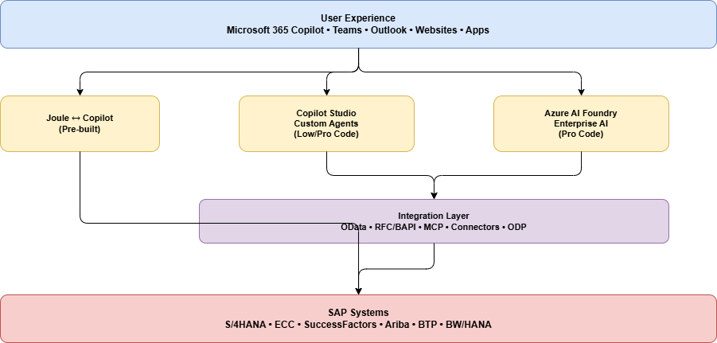

# About SAP with Microsoft AI

> [!Important]
> When consuming SAP APIs and interfaces, always ensure your usage complies with [SAP's API Policy](https://help.sap.com/doc/sap-api-policy/latest/en-US/API_Policy_latest.pdf). Please check with your SAP contact or account team if you have questions about permitted API usage in your specific scenario.

## What Is Microsoft AI with SAP?

Microsoft AI with SAP refers to the combination of Microsoft's AI platform and tools—including **Microsoft 365 Copilot**, **Copilot Studio**, and **Azure AI Foundry**—with SAP's enterprise systems to create intelligent, AI-powered business experiences on top of SAP data and processes.

SAP systems are the operational backbone of many organizations, managing financials, supply chain, procurement, HR, and more. Microsoft AI enables organizations to unlock the value in these systems by:

- Bringing **natural language interfaces** to SAP data (ask questions, get answers — no transaction codes needed)
- Building **AI agents** that can reason over SAP data and take action across business processes
- Enabling **agentic automation** that can orchestrate multi-step SAP workflows

## Why Would You Do This?

### For End Users
- **Stay in your flow of work** — interact with SAP from Teams, Outlook, Excel, or Copilot Chat without switching to SAP GUI or Fiori
- **Natural language access** — ask "What is the status of PO 4500001234?" instead of navigating ME23N
- **Faster decisions** — get insights from SAP data combined with emails, documents, and other sources in one place

### For Organizations
- **Reduce training overhead** — users interact with SAP through natural language, not complex UIs
- **Accelerate processes** — AI agents can automate multi-step workflows that previously required manual SAP transactions
- **Enable citizen developers** — business users can build agents with low-code tools in Copilot Studio
- **Maintain governance** — enterprise-grade security, compliance, and access controls across all AI interactions with SAP

### Common Business Scenarios

| Area | Example |
| --- | --- |
| **Finance** | "Show me the trial balance for cost center 1000" — answered from SAP S/4HANA |
| **Procurement** | "What purchase orders are pending approval?" — queried from SAP Ariba or S/4HANA |
| **HR** | "What is my remaining leave balance?" — retrieved from SAP SuccessFactors |
| **Supply Chain** | "What is the delivery status for sales order 800123?" — checked in SAP |

## What Can You Do?

Microsoft offers three complementary layers for bringing AI to SAP environments:

### 1. Use Out-of-the-Box: Joule ↔ Microsoft 365 Copilot

The managed integration between **SAP Joule** and **Microsoft 365 Copilot** provides a prebuilt, bi-directional connection. Users in Microsoft 365 Copilot or Teams can ask SAP-related questions, and the request is routed to SAP Joule for processing — no custom development required.

→ [Learn more about Joule & Copilot](./joule/joule-copilot-overview.md)

### 2. Extend with Custom Agents: Copilot Studio

**Copilot Studio** enables you to build company-specific agents that access SAP data through connectors, APIs, or custom plugins. These agents can be deployed in Microsoft Teams, Microsoft 365 Copilot, websites, or other channels. Options range from low-code (Agent Builder) to pro-code (Microsoft 365 Agents SDK).

→ [Learn more about Copilot Studio & SAP](./copilot-studio/copilot-with-sap-overview.md)

### 3. Build Enterprise AI Solutions: Azure AI Foundry

**Azure AI Foundry** is the full AI platform for advanced scenarios — custom models, multi-agent orchestration, MCP tools, and deep integration with SAP APIs (OData, RFC, BAPIs). Build sophisticated agents that can reason, plan, and execute complex multi-step workflows.

→ [Learn more about Foundry AI & SAP](./foundry/foundry-ai-sap.md)

## How These Pieces Fit Together

## How to Get Started

### Starting Point 1: "I want quick value with minimal setup"

**→ Start with Joule ↔ Copilot integration**

If your organization has Microsoft 365 Copilot licenses and SAP Joule enabled, the managed integration gets you started without custom development. Users can ask SAP questions directly in Teams or Copilot Chat.

📖 [Joule & Copilot setup guide](./joule/joule-copilot-overview.md#setup--configuration)

### Starting Point 2: "I want to build a custom agent using low-code for a specific process that needs information from an SAP system"

**→ Start with Copilot Studio**

Use Copilot Studio to build agents tailored to your business processes. Connect to SAP via OData connectors, custom connectors, or Power Platform connectors. Deploy to Teams, Microsoft 365 Copilot, or websites.

📖 [Copilot Studio & SAP architecture options](./copilot-studio/copilot-with-sap-overview.md)

### Starting Point 3: "I want advanced AI agents with multi-step workflows that include SAP systems"

**→ Start with Azure AI Foundry**

For complex scenarios involving multi-agent orchestration, custom models, or deep SAP integration (BAPIs, RFCs, multi-step transactions), Azure AI Foundry provides the full platform.

📖 [Foundry AI & SAP overview](./foundry/foundry-ai-sap.md)

## Decision Guide

| Question | If Yes → |
| --- | --- |
| Do you have Microsoft 365 Copilot + SAP Joule already? | Start with [Joule ↔ Copilot](./joule/joule-copilot-overview.md) |
| Do you need a custom agent for a specific process? | Start with [Copilot Studio](./copilot-studio/copilot-with-sap-overview.md) |
| Do you need multi-agent orchestration or complex workflows? | Start with [Azure AI Foundry](./foundry/foundry-ai-sap.md) |
| Do you want all of these? | Combine them — they work together |

## Key Principles

- **These options are complementary, not competing.** Most organizations use a combination based on the use case.
- **Start simple, grow complex.** Begin with Joule or a simple Copilot Studio agent, then expand to Foundry for advanced scenarios.
- **SAP stays the system of record.** Microsoft AI adds an intelligence layer on top — it doesn't replace SAP.
- **Security and governance are built in.** All integrations respect SAP authorizations, Microsoft Entra ID, and enterprise compliance requirements.

## Links & Resources

- [SAP & Microsoft Partnership](/training/modules/microsoft-sap-partnership/)
- [Azure AI Foundry](https://ai.azure.com/)
- [Microsoft Copilot Studio](https://www.microsoft.com/en-us/microsoft-copilot/microsoft-copilot-studio)
- [Microsoft Fabric](https://www.microsoft.com/en-us/microsoft-fabric)
- [SAP Joule & Microsoft 365 Copilot Integration](https://help.sap.com/docs/joule/integrating-joule-with-sap/integrating-joule-with-microsoft-365-copilot)
