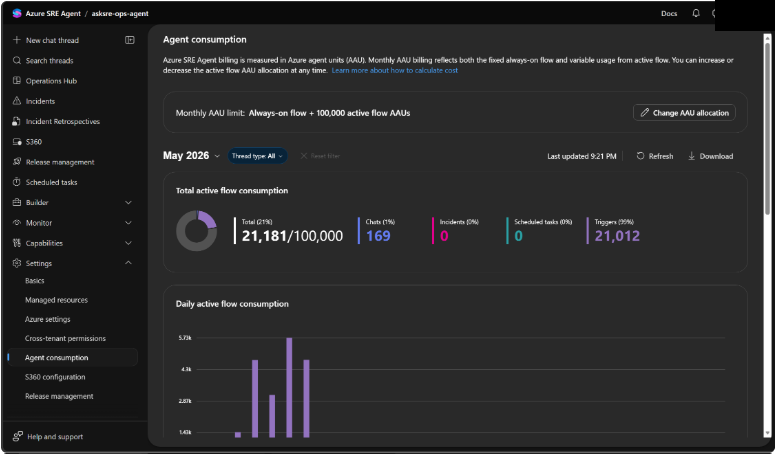
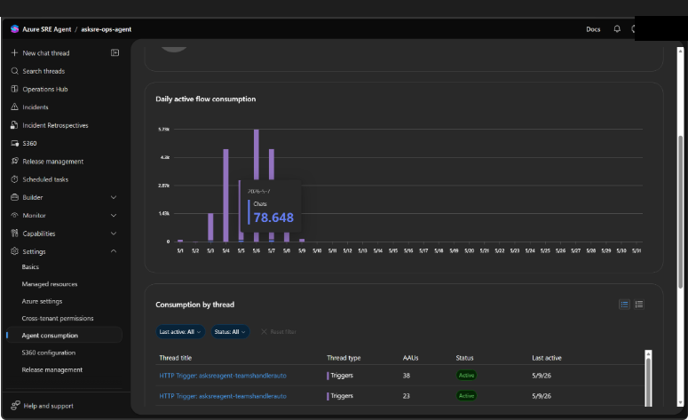

# Monitor agent usage in Azure SRE Agent

> [!TIP]
> - See AAU consumption broken down by thread type — Chats, Incidents, Scheduled tasks, and Triggers
> - Drill into per-thread usage to identify which conversations or tasks cost the most
> - Filter by type, date, or status and download thread-level data as CSV
> - Adjust your active flow AAU allocation (500–1,000,000) with changes linked to pricing and billing

## See where your AAUs are going

Your agent runs conversations, processes incidents, and executes scheduled tasks — all consuming Azure Agent Units. The consumption page shows you exactly where those AAUs go: which thread types drive cost, which individual threads are most expensive, and how usage trends day over day.

## Agent consumption

View your AAU usage at **Settings** > **Agent consumption**.

Azure SRE Agent billing is measured in Azure Agent Units (AAU). Your monthly allocation includes both a fixed **always-on flow** and a variable **active flow** that you can adjust. The consumption page breaks down your usage by thread type so you can see exactly where your AAUs are going.



### What the consumption page shows

The page has four sections, stacked top to bottom:

| Section | What it displays |
|---------|-----------------|
| **Monthly AAU limit** | Your total allocation with a **Change AAU allocation** button to adjust it |
| **Total active flow consumption** | Donut chart showing the proportion used by each thread type, with clickable stat cards for Chats, Incidents, Scheduled tasks, and Triggers — each showing its count and percentage of total |
| **Daily active flow consumption** | Stacked bar chart with one bar per day, color-coded by thread type, so you can spot daily patterns and usage spikes |
| **Consumption by thread** | Table listing every thread with its title, type, AAU consumption, status (Active or Completed), and last active date |

Above the cards, a **month selector** lets you view any of the last six months. Use the **type filter** to narrow the entire page to a single thread type.

### Thread types

All agent activity is classified into four types:

| Type | What it includes |
|------|-----------------|
| **Chats** | Portal conversations, Teams messages, Playground sessions, welcome messages |
| **Incidents** | Incident investigations, pre-incident analysis, retrospectives |
| **Scheduled tasks** | Recurring automated tasks |
| **Triggers** | HTTP triggers, Azure Monitor alerts, daily reports |

### Filtering and drilling down

Click any **stat card** on the summary donut to filter the entire page to that thread type — the daily chart and thread table update to show only matching threads. Click a **bar** on the daily chart to filter to that specific day. The thread table also has its own filters for **date** and **status** (Active or Completed).

The thread table supports two views:

- **List** — a flat sortable table of all threads
- **Grouped** — threads organized by type with collapsible groups

Each thread title is a link — click it to open the full conversation thread.

### Downloading usage data

Select **Download** next to the **Refresh** button above the charts to export the currently visible threads as a CSV file. The export includes thread title, type, AAUs consumed, status, last active date, and thread ID. All active filters are respected, so you can export just the data you need.



### Adjusting your allocation

Select **Change AAU allocation** on the monthly limit card to increase or decrease your active flow AAU limit (500–1,000,000). This controls active flow only — always-on flow is fixed and billed separately. For full details on how allocation changes work, billing impact, and what happens when you hit the limit, see [Pricing and billing - Set an active flow spending limit](pricing-billing.md#set-an-active-flow-spending-limit).

## Limits

| Resource | Limit |
|----------|-------|
| **Active flow AAU allocation** | 500 – 1,000,000 AAUs (always-on flow is fixed and not adjustable) |
| **Usage history** | Last 6 months viewable via the month selector |
| **Thread table** | Scroll-paginated, loads 15 rows at a time |
| **Usage tracking** | Per-agent consumption visible to Contributor and Owner roles |

## Get started

Usage monitoring is built-in — go to **Settings** > **Agent consumption** to see your AAU breakdown immediately.

| Resource | What you'll learn |
|----------|-------------------|
| [Pricing and billing](pricing-billing.md) | Understand AAU billing, allocation, and cost management |
| [Review agent insights](review-agent-insights.md) | See how well your agent handled each conversation |
| [Track incident value](track-incident-value.md) | Measure the impact of your agent's incident investigations |

## Related capabilities

| Capability | What it adds |
|------------|---------------|
| [Review agent insights](review-agent-insights.md) | Per-thread conversation summaries and qualitative evaluation |
| [Track incident value](track-incident-value.md) | Incident metrics and daily reports |
| [Audit agent actions](audit-agent-actions.md) | Permissions, access control, and action logging |
| [Application Insights](/azure/azure-monitor/app/app-insights-overview) | Azure documentation for custom KQL queries |
```

---
