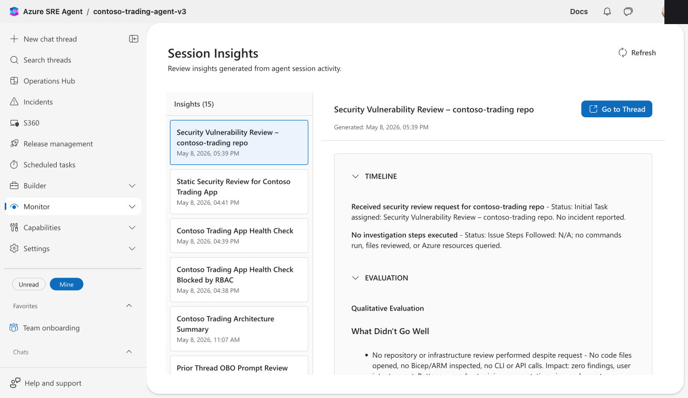
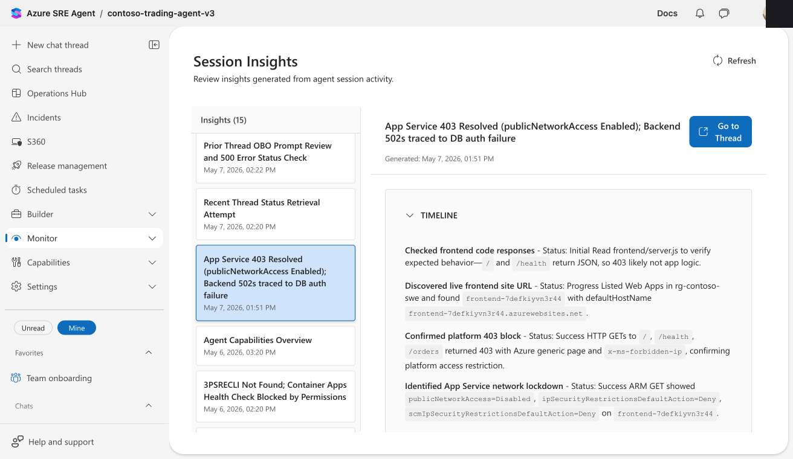

# Review agent insights in Azure SRE Agent

Your agent handles dozens of conversations, incidents, and tasks each day. By using session insights, you can see *how well* it handled each one. Did it resolve the incident efficiently or stumble through a dozen wrong queries first? Did it follow your response plan or go off-script? Did it learn anything reusable from the investigation?

## What's in an insight

Your agent automatically generates a structured insight after each conversation or investigation. Each insight has three sections:

**Timeline**: A chronological view of the investigation, showing up to eight milestones. Each milestone has a status (Initial, Progress, Success, Issue, or Resolved) and a description of what the agent did and found.

**Evaluation**: A qualitative assessment of what went well and what didn't, with specific evidence from the session. Each item references actual commands, error codes, resource names, or CLI output, not vague statements.

> [!NOTE]
> Evaluation might not appear for short or routine conversations where the agent didn't perform enough actions to evaluate.

**Derived learning**: Knowledge the agent extracted, such as specific system design details discovered (for example, "frontend-7defkiyvn3r44 has publicNetworkAccess=Disabled, causing the 403") and reusable investigation patterns.

## Where to find insights

Go to **Monitor** > **Session Insights**. The dashboard shows a list of insights on the left (newest first) and the full detail on the right.

Select any insight to view its Timeline, Evaluation, and Derived Learning in expandable sections. Each insight also has a **Go to Thread** button to open the original conversation.

## Providing feedback

Each insight has a feedback section at the bottom where you can:

1. Rate the insight as helpful (👍) or needs improvement (👎).
1. Add an optional comment explaining your assessment.
1. Select **Submit** to save your feedback.

Your feedback helps improve future insights. The system analyzes comments for actionable corrections and can flag them for review if they contain important findings about agent behavior.

## Limits

| Resource | Limit |
|----------|-------|
| **Insights per agent** | Up to 1,000 viewable in the dashboard |
| **Timeline milestones** | Up to 8 per insight |
| **Evaluation** | Qualitative assessment: what went well and what didn't go well, with evidence |
| **Derived learning items** | Up to 3 system design insights and 2 investigation patterns per session |
| **Availability** | Enabled by default for all agents |

## Get started

Insights are generated automatically. Go to **Monitor** > **Session Insights** to start reviewing your agent's work.

## Related content

- [Monitor agent usage](monitor-agent-usage.md)
- [Track incident value](track-incident-value.md)
- [Audit agent actions](audit-agent-actions.md)
