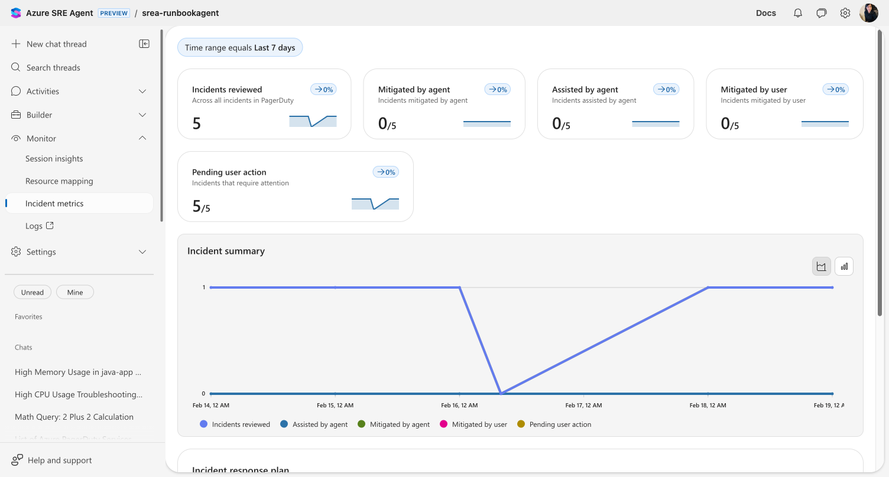
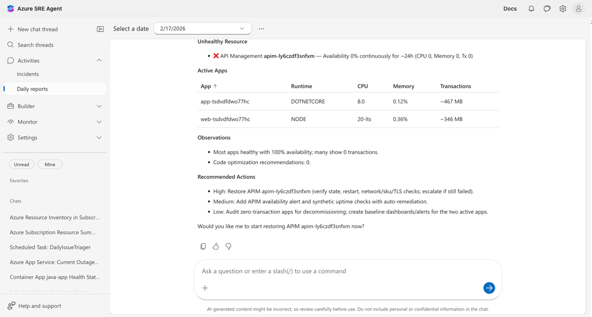

# Track incident value in Azure SRE Agent

> [!TIP]
> - See your agent's mitigation rate, assist rate, and pending actions with trend sparklines
> - Track Intent Met — a 1–5 quality score across incidents, scheduled tasks, and conversations
> - Drill into each response plan to identify which automation strategies resolve the most incidents
> - Receive automated daily reports covering security findings, resource health, and incident summaries

## The problem: proving your agent is working

You deployed an AI agent to handle incidents. Leadership wants to know: *Is it reducing toil? Which incidents is it resolving on its own? Are we getting ROI?*

Answering those questions today means querying telemetry, cross-referencing tickets, and guessing which response plans work. There's no single view showing what your agent did, how each response plan performed, or whether mitigation rates are improving.

## Incident metrics dashboard

Navigate to **Monitor** > **Incident metrics** to see the dashboard.



### Metric cards

Each card shows a count, its proportion of total incidents, and a sparkline with week-over-week change:

| Metric | What it tells you |
|--------|------------------|
| **Incidents reviewed** | Total incidents your agent investigated in the selected time range |
| **Mitigated by agent** | Incidents resolved autonomously — the core ROI metric |
| **Assisted by agent** | Incidents where the agent provided investigation data and a human completed resolution |
| **Mitigated by user** | Incidents resolved entirely by a human — potential automation opportunities |
| **Pending user action** | Incidents waiting for human input — your current backlog |

The **Incident summary** chart plots all five metrics over time so you can spot trends.

### Response plan breakdown

Below the chart, a **Response plan** grid breaks down performance per plan. Click any plan to drill into its incident history and root cause categories.

This is where decisions happen. You can see which plans run in Autonomous mode and resolve incidents without human involvement versus plans that still require approval. A plan with zero autonomous mitigations is a signal to adjust its instructions or increase its autonomy level.

### Intent Met score

The **Intent Met score** measures how effectively your agent resolves work on a 1–5 scale. After each thread completes, an automated evaluation scores the outcome:

| Score | Meaning |
|-------|---------|
| **5** | Exceptionally resolved — exceeded expectations |
| **4** | Well resolved — successfully completed |
| **3** | Partially resolved — made progress but didn't fully resolve |
| **2** | Poorly resolved — attempted but failed significantly |
| **1** | Completely unresolved — failed to address the core objective |

The Intent Met card on the **Overview** dashboard shows the average score across all threads from the past 30 days with a daily trend sparkline. The score combines incident threads, scheduled task threads, and conversations into a single quality metric.

Intent Met scoring is fully automatic — no configuration needed.

> [!TIP]
> If your Intent Met score is lower than expected, review individual threads in [Session Insights](review-agent-insights.md) to understand where the agent struggled.

## Incident overview

Go to **Incidents** in the left sidebar for a real-time view of every incident your agent is handling. Each row links to the agent's investigation thread — review which tools it called, what evidence it found, and what it recommended.

## Daily reports

Your agent generates automated daily reports at **Daily reports** in the left sidebar.



Select a date to view that day's report. Each report covers:

- **Security findings** — CVE vulnerabilities across connected repositories, grouped by severity
- **Incidents** — Active, mitigated, and resolved counts with per-incident details
- **Health and performance** — Per-resource health status with availability, CPU, and memory metrics
- **Recommended actions** — Prioritized action items with descriptions and estimated effort

Daily reports replace the "what happened overnight?" morning routine — the information is compiled and waiting.

## Limits

| Resource | Limit |
|----------|-------|
| **Scorecard data** | Retained in Application Insights (follows your workspace retention policy) |
| **Daily reports** | Generated once per day |
| **Intent Met scoring** | Applied automatically to incidents, scheduled tasks, and conversations |

## Get started

Incident tracking is built-in — open **Monitor** > **Incident metrics** once your agent starts handling incidents.

| Resource | What you'll learn |
|----------|-------------------|
| [Set up a response plan](response-plan.md) | Configure response plans that generate tracking data |

## Related capabilities

| Capability | What it adds |
|------------|--------------|
| [Automate incident response](incident-response.md) | Configure response plans for each incident type |
| [Automate tasks on a schedule](scheduled-tasks.md) | Set up recurring tasks reflected in Intent Met scores |
| [Monitor agent usage](monitor-agent-usage.md) | Track AAU consumption alongside incident metrics |
| [Review agent insights](review-agent-insights.md) | Per-thread qualitative evaluation of agent performance |
| [Audit agent actions](audit-agent-actions.md) | Review specific actions during incident investigations |
```

---
