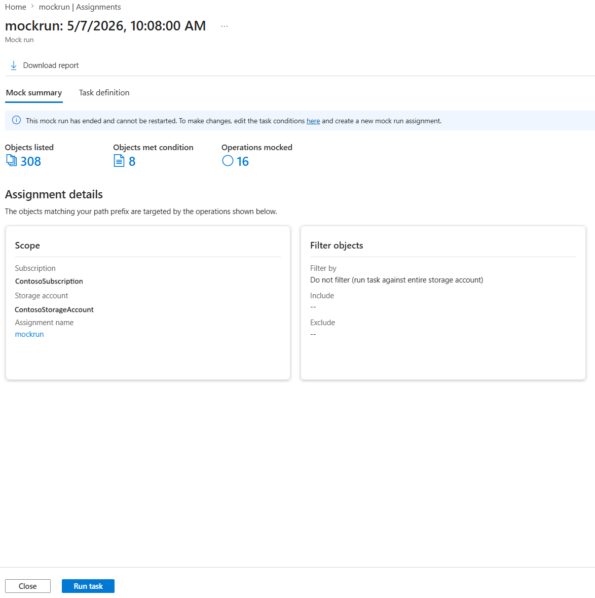

---
# Required metadata
# For more information, see https://learn.microsoft.com/en-us/help/platform/learn-editor-add-metadata
# For valid values of ms.service, ms.prod, and ms.topic, see https://learn.microsoft.com/en-us/help/platform/metadata-taxonomies

title: Mock runs for storage task assignments
description: Learn about mock runs — a way to simulate storage task assignment execution without performing any operations on your blobs.
author: sshankMSFT
ms.author:   shashankar # Microsoft alias
ms.service: azure-storage-actions
ms.topic: concept-article
ms.date: 05/07/2026
---
# Mock runs for storage task assignments 

### What is a mock run?

A mock run lets you simulate the execution of a storage task assignment without actually performing any operations on your blobs. When you create a mock run, Azure Storage Actions scans and evaluates your blobs against the task conditions exactly as it would during a real run, but no operations are executed. Instead, a detailed report is generated showing which blobs matched the conditions and what operations _would have been_ performed.

Mock runs are useful when you want to:

*   **Preview the impact** of a task before running it at scale, especially when operations are irreversible (such as delete or immutability policy).
*   **Validate conditions** on the full set of blobs in your account, not just a small preview sample.
*   **Generate audit-ready reports** showing which blobs would be affected, without making any changes.
*   **Estimate cost** by understanding how many blobs would be targeted and how many operations would be invoked.

> [!NOTE]  
> A mock run scans and evaluates all blobs in scope, just like a real run. The only difference is that no operations are performed on the blobs. Because no operations are executed, mock runs are typically faster than real runs.

### How mock runs work

A mock run is created as a storage task assignment with the trigger type set to **MockRun**. Like other assignment types, a mock run targets a specific storage account, uses optional prefix filters to scope the blobs, and generates execution reports in a designated export container.

When a mock run executes:

1.  Azure Storage Actions enumerates all blobs matching the assignment's scope and prefix filters.
2.  Each blob is evaluated against the storage task's conditions.
3.  For blobs that match, the operations that _would_ be performed are recorded — but **no operations are actually executed**.
4.  A detailed report is generated listing the matched blobs and their simulated operations.

### Mock run vs. condition preview

Both mock runs and the condition preview feature help you validate task conditions before execution, but they serve different purposes:

| Capability | Condition preview | Mock run |
| --- | --- | --- |
| **Scope** | Limited sample (up to 5,000 blobs) | Full-scale — all blobs in the assignment scope |
| **Operations shown** | No | Yes — shows which operations would be performed |
| **Report generated** | No | Yes — downloadable CSV report |
| **Execution model** | Synchronous, immediate results | Asynchronous, runs like a real assignment |
| **Billing** | No charge | Charged for task execution instance and objects scanned (no operations charge) |
| **Use case** | Quick spot-check while authoring conditions | Full validation before production execution |

Use condition preview while composing your task conditions, then use a mock run for final validation before enabling a real run.

### Mock run lifecycle and states

Mock runs follow the same lifecycle as run-once assignments.

> [!IMPORTANT]  
> A completed mock run cannot be restarted. To run another mock simulation with the same configuration, you must create a new assignment or duplicate the existing one.

### Concurrency behavior

Only one run — whether mock or real — can execute on a storage account at a time. This is the same concurrency model as real task runs:

*   If a **real run is in progress**, a new mock run is **queued** until the real run completes.
*   If a **mock run is in progress**, a new real task run is **queued** (or skipped for scheduled runs).
*   If another **mock run is in progress**, the new mock run is **queued**.

This ensures stability and prevents resource contention on the target storage account.

### Mock run reports

When a mock run finishes, a detailed report is written to the report export container specified during assignment creation. Reports are available in **CSV** formats.

You can also view a summary of the run directly in the Azure portal on the assignment's mock run results page, including the number of objects listed, objects that met the conditions, and operations that would have been performed.

<!-- TODO: Add a sanitized screenshot (no internal subscription details) once available.
> 
-->

**Report columns:**

| Column | Description |
| --- | --- |
| **Container** | The container where the blob resides. |
| **Blob** | The name of the blob. |
| **Operation to be performed** | The simulated operation, prefixed with `(mock)` — for example, `(mock) DeleteBlob` or `(mock) SetBlobImmutability`. |
| **Matched condition block** | Which condition block the blob matched (for example, `IF` or `ELSE`). |

**Example CSV output:**

| Container | Blob | Operation to be performed | Matched condition block |
| --- | --- | --- | --- |
| testContainer1 | output1.log | (mock) DeleteBlob | IF |
| testContainer2 | output2.log | (mock) DeleteBlob | IF |
| testContainer1 | financials1.csv | (mock) SetBlobImmutability | ELSE |
| testContainer2 | financials2.csv | (mock) SetBlobImmutability | ELSE |

A **summary JSON** file is also generated alongside the report, containing aggregate metrics:

```
{
  "completionTime": "2024-10-21T17:46:59",
  "destination": "taskoutput",
  "endpoint": "https://contoso1storage1.blob.core.windows.net",
  "fileFormat": "csv",
  "fileSchema": [
    "Container",
    "Blob",
    "Operation to be performed",
    "Result",
    "Matched condition block"
  ],
  "files": [
    "<link to the reporting file>"
  ],
  "objectsListed": 1100,
  "objectsToBeOperated": 240,
  "operationType": "BlobOperation",
  "runId": "mockrun-assignment-2024-10-21T17:30:13.9121342Z",
  "startTime": "2024-10-21T17:37:12",
  "status": "succeeded"
}
```

Key fields in the summary:

*   **objectsListed**: Total number of blobs scanned during the mock run.
*   **objectsToBeOperated**: Number of blobs that matched the conditions and would have had operations performed.
*   **status**: The outcome of the mock run (`succeeded` or `failed`).

### Transitioning from mock run to real run

After reviewing the mock run report and confirming the results are as expected, you can transition the assignment from a mock run to a real run:

1.  Navigate to the assignment in the Azure portal.
2.  Edit the assignment and change the trigger type from **Mock run** to **Run once** or **Recurring**.
3.  Save the updated assignment.

This allows you to go from validation to execution without recreating the assignment from scratch.

### Pricing

Mock runs are billed similarly to real task assignment runs, with one key difference: **no charge is applied for the operations meter**, since no operations are actually performed on blobs.

| Billing meter | Applies to mock runs? |
| --- | --- |
| Task execution instance (per run) | ✅ Yes |
| Objects targeted (per million objects scanned) | ✅ Yes |
| Operations performed (per million operations) | ❌ No (always $0) |

Standard Blob Storage API costs for listing and reading blob properties during the scan still apply.

> [!TIP]  
> Because mock runs exclude the operations meter charge, they are significantly cheaper than real runs — making them a cost-effective way to validate your task configuration before committing to a full execution.

### Permissions

The managed identity associated with the storage task must have the appropriate role on the target storage account to perform a mock run. Although no operations are performed, the identity needs read access to scan and evaluate blobs:

*   **Minimum role:** Storage Blob Data Reader
*   **Recommended role:** Storage Blob Data Owner (if you plan to transition to a real run using the same assignment)

Both system-assigned and user-assigned managed identities are supported for mock runs.

If the target storage account has network restrictions, ensure that the **Allow trusted Microsoft services** option is enabled in the account's networking configuration.

### See also

*   [Create and use a mock run](storage-task-mock-run-create.md)
*   [Storage task assignment](storage-task-assignment.md)
*   [Storage task runs](storage-task-runs.md)
*   [Best practices for storage tasks](storage-task-best-practices.md)
