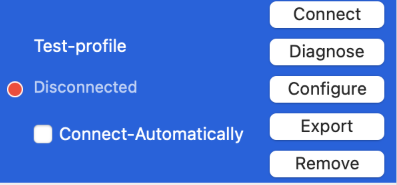
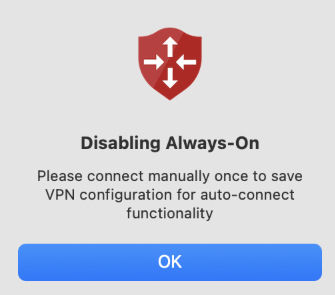
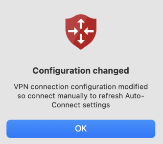
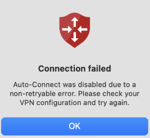

> [!NOTE]
> Note the following prerequisites for Always On VPN user tunnels on macOS:
> - The Azure VPN Client for macOS must be [version 3.0.0](/azure/vpn-gateway/azure-vpn-client-versions) or later.
> - Always On must be configured per profile - there's no default Always On profile.
> - Only one profile can have Always On enabled at a time.
> - Always On can only be enabled when the VPN connection is disconnected.
> - Disconnecting an Always On profile disables the Always On feature for that profile.

1. Open the Azure VPN Client for Mac.
1. Select the profile you want to configure for Always On. If there isn't a client profile downloaded, follow the steps in **[this document](need to configure cert based auth doc for Mac Client)** to configure a profile for your VPN client.
1. Ensure the connection is in disconnected mode.
1. Select the checkbox for **Connect-Automatically**. 
1. Select **Connect** to establish the VPN connection.
1. If the connection succeeds, you successfully configured an Always On user tunnel. 

## Understanding pop-up windows
### Disabling Always-On

You need to connect manually by selecting **Connect** button so that VPN configuration is saved for Always-On connect functionality to work. At this point, you should select the **Disconnect** button and then enabling the Always-On checkbox should work. 

### Configuration changed

Since the configuration was modified, you need to connect manually by selecting **Connect** button** so that new VPN configuration is saved for Always-On connect functionality to work. Select the **Disconnect** button and enabling the Always-On checkbox should work with the updated configuration. 

### Connection failed - Nonretryable error

Always on was disabled due to nonretryable error. You need to connect manually by selecting **Connect** button. Selecting the **Disconnect** button and then enabling Always-On checkbox should work. 

### Connection failed - Repeated connection failures

Always on was disabled because connection can't be established after max retry attempts is exceeded. You need to fix the VPN profile configuration. Use [Troubleshoot Azure VPN Client](/articles/vpn-gateway/troubleshoot-azure-vpn-client.md) and [Troubleshoot VPN Point-to-Site Connection Problems](/articles/vpn-gateway/vpn-gateway-troubleshoot-vpn-point-to-site-connection-problems.md) to help troubleshoot the issue.

Once fixed, selecting the **Disconnect** button and then enabling Always-On checkbox should work. 